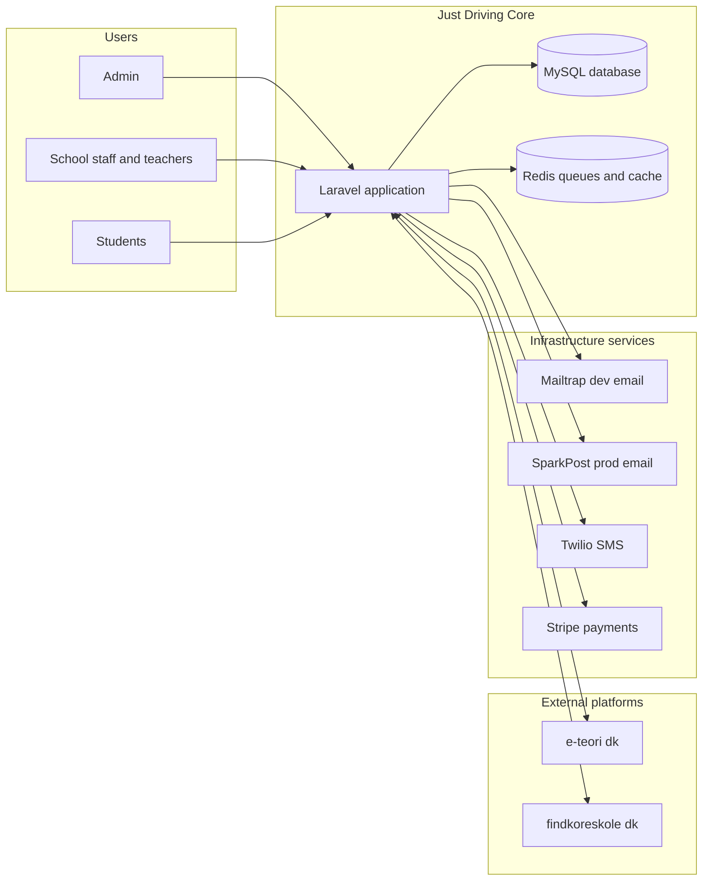

# High-Level System Diagram

This page gives a high-level view of the Just Driving architecture, including the core application, supporting infrastructure, and the main external platforms and services it integrates with. It is intended to help new developers understand how the major parts fit together before diving into implementation details.

## Overview

At the center of the system is the Just Driving Laravel application, backed by a MySQL database and Redis for queues and caching. Different user types (admins, school staff/teachers, and students) access the application through the web UI and APIs. The application integrates with external platforms such as e-teori.dk and findkoreskole.dk, and with infrastructure services like Mailtrap/SparkPost for email, Twilio for SMS, and Stripe for payments.

## Mermaid system diagram

## Key points

- All main user groups (admins, school staff/teachers, and students) interact with the Just Driving Laravel application through the web interface or APIs.
- The application stores business data (schools, students, teachers, bookings, finances, etc.) in MySQL and uses Redis for queues and optional caching.
- External platforms (e-teori.dk and findkoreskole.dk) integrate with Just Driving through defined data flows and APIs.
- Infrastructure services handle cross‑cutting concerns:
  - Mailtrap for development email and SparkPost for production email delivery.
  - Twilio for sending SMS notifications.
  - Stripe for handling online payments and payment-related events.
