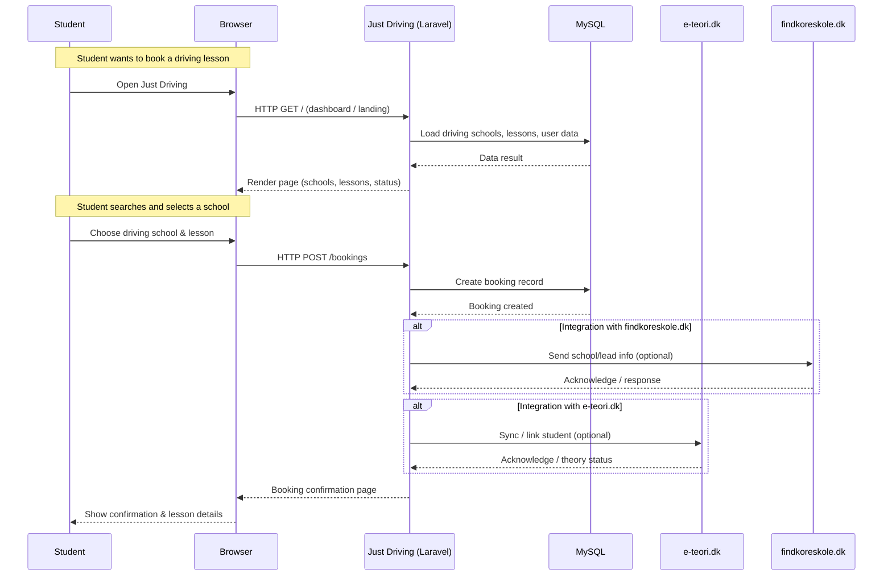

# High-level system diagram

Below is a simple text-based high-level diagram you can use directly in Docusaurus (for example with Markdown, or adapt it to Mermaid/PlantUML later).

## Overview

At a high level, Just Driving is a Laravel (PHP 7.*) web application that connects users via a browser to a MySQL-backed API, integrates with external platforms, and serves different interfaces for Admins, Teachers, and Students.

## Text diagram (ASCII)

