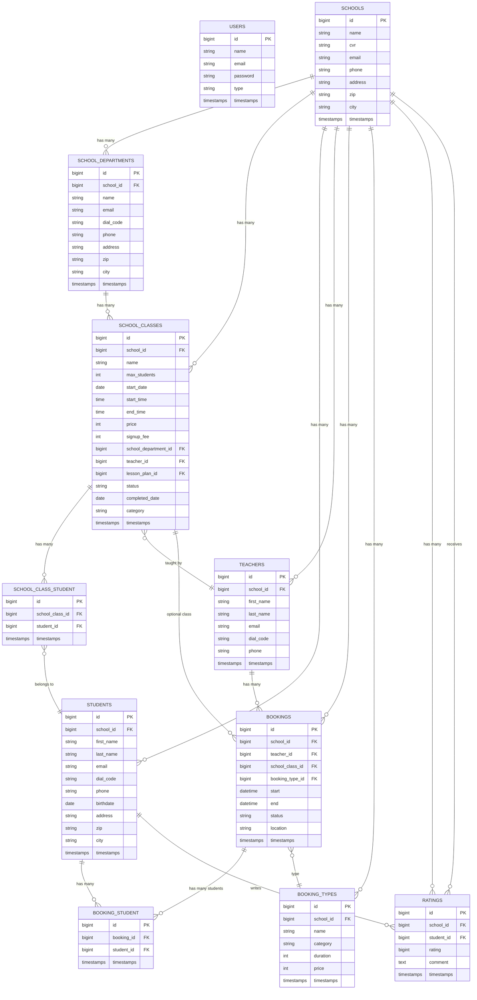

# ER diagram

```mermaid
erDiagram
    USERS {
        bigint id PK
        string name
        string email
        string password
        string type
        timestamps timestamps
    }
    SCHOOLS {
        bigint id PK
        string name
        string cvr
        string email
        string phone
        string address
        string zip
        string city
        timestamps timestamps
    }

    SCHOOL_DEPARTMENTS {
        bigint id PK
        bigint school_id FK
        string name
        string email
        string dial_code
        string phone
        string address
        string zip
        string city
        timestamps timestamps
    }

    SCHOOL_CLASSES {
        bigint id PK
        bigint school_id FK
        string name
        int max_students
        date start_date
        time start_time
        time end_time
        int price
        int signup_fee
        bigint school_department_id FK
        bigint teacher_id FK
        bigint lesson_plan_id FK
        string status
        date completed_date
        string category
        timestamps timestamps
    }

    SCHOOL_CLASS_STUDENT {
        bigint id PK
        bigint school_class_id FK
        bigint student_id FK
        timestamps timestamps
    }

    STUDENTS {
        bigint id PK
        bigint school_id FK
        string first_name
        string last_name
        string email
        string dial_code
        string phone
        date birthdate
        string address
        string zip
        string city
        timestamps timestamps
    }

    TEACHERS {
        bigint id PK
        bigint school_id FK
        string first_name
        string last_name
        string email
        string dial_code
        string phone
        timestamps timestamps
    }

    BOOKINGS {
        bigint id PK
        bigint school_id FK
        bigint teacher_id FK
        bigint school_class_id FK
        bigint booking_type_id FK
        datetime start
        datetime end
        string status
        string location
        timestamps timestamps
    }

    BOOKING_STUDENT {
        bigint id PK
        bigint booking_id FK
        bigint student_id FK
        timestamps timestamps
    }

    BOOKING_TYPES {
        bigint id PK
        bigint school_id FK
        string name
        string category
        int duration
        int price
        timestamps timestamps
    }

    RATINGS {
        bigint id PK
        bigint school_id FK
        bigint student_id FK
        bigint rating
        text comment
        timestamps timestamps
    }

    %% Relationships

    SCHOOLS ||--o{ SCHOOL_DEPARTMENTS : "has many"
    SCHOOLS ||--o{ SCHOOL_CLASSES : "has many"
    SCHOOLS ||--o{ STUDENTS : "has many"
    SCHOOLS ||--o{ TEACHERS : "has many"
    SCHOOLS ||--o{ BOOKINGS : "has many"
    SCHOOLS ||--o{ BOOKING_TYPES : "has many"
    SCHOOLS ||--o{ RATINGS : "has many"

    SCHOOL_DEPARTMENTS ||--o{ SCHOOL_CLASSES : "has many"

    SCHOOL_CLASSES ||--o{ SCHOOL_CLASS_STUDENT : "has many"
    SCHOOL_CLASS_STUDENT }o--|| STUDENTS : "belongs to"
    SCHOOL_CLASSES }o--|| TEACHERS : "taught by"

    STUDENTS ||--o{ BOOKING_STUDENT : "has many"
    TEACHERS ||--o{ BOOKINGS : "has many"

    BOOKINGS ||--o{ BOOKING_STUDENT : "has many students"
    BOOKINGS }o--|| SCHOOL_CLASSES : "optional class"
    BOOKINGS }o--|| BOOKING_TYPES : "type"

    STUDENTS ||--o{ RATINGS : "writes"
    SCHOOLS ||--o{ RATINGS : "receives"

```