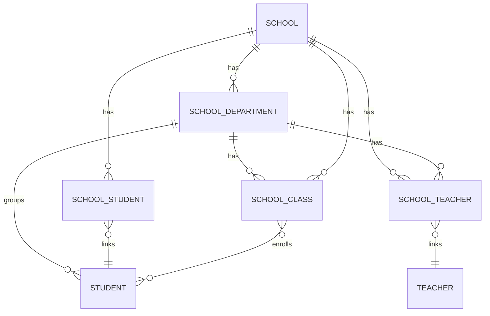
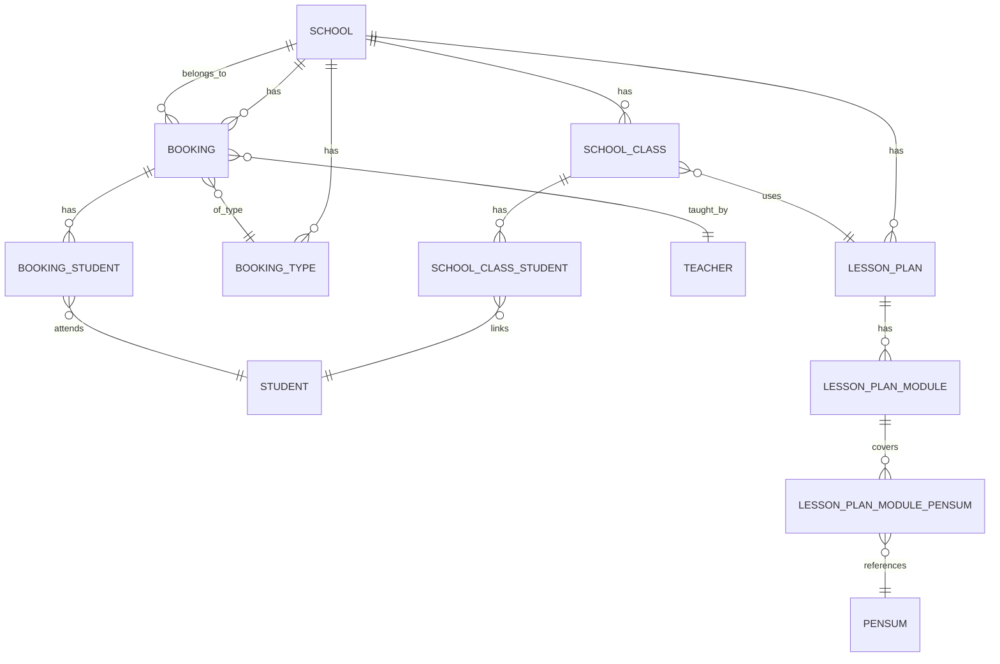
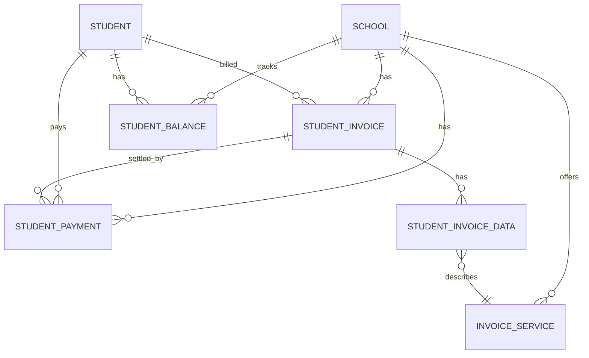
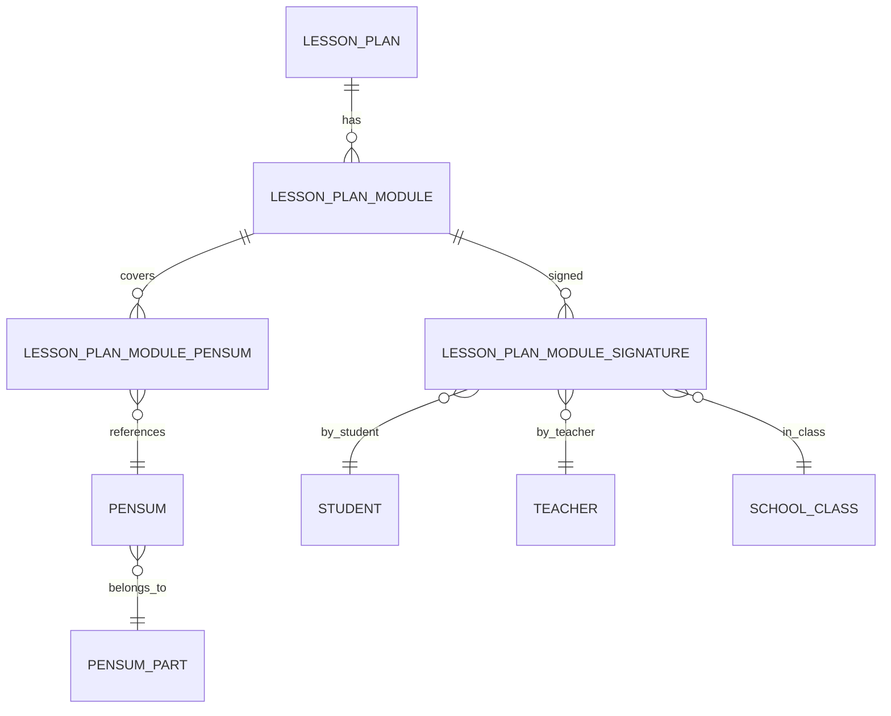

# ER Diagrams

This page shows entity–relationship (ER) diagrams for the most important parts of the Just Driving data model. The goal is to give developers a visual view of how entities connect, complementing the textual descriptions from the Entities and Relationship Overview pages.

## Schools, departments, teachers, and students

This diagram focuses on how schools, departments, teachers, and students are linked.

- A school can have many departments, teachers, students, and classes.  
- Departments group classes, teachers, and students under a school.  
- Link tables connect teachers and students to schools so a person can be associated with more than one school if needed.

## Classes, bookings, and lesson plans

This diagram shows how classes, bookings, booking types, lesson plans, and modules connect.

- Classes link students to a specific course/lesson plan.  
- Bookings represent concrete scheduled events and are typed via booking types.  
- Lesson plans and modules structure the educational content and are connected to bookings and classes via configuration and usage.

## Finance: invoices, payments, and balances

This diagram focuses on the core financial entities.

- Each school issues invoices and receives payments; these are tied to students.  
- Invoice data (line items) describes what a student is billed for, often referencing invoice services.  
- Student balances summarize the net financial position for each student.

## Education, pensum, and signatures

This diagram shows how lesson plans tie into pensum and signatures.

- Pensum and pensum parts represent curriculum requirements.  
- Lesson plan modules reference pensum entries to ensure the required content is covered.  
- Signatures create an audit trail showing which student and teacher signed off each module and in which class.
