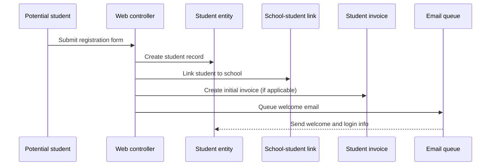
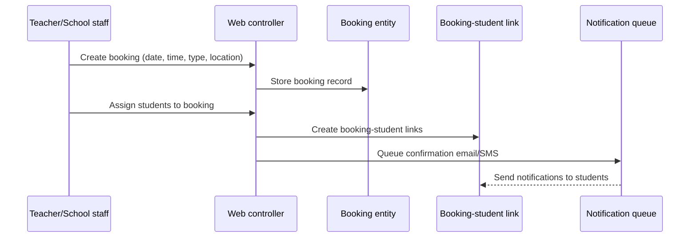
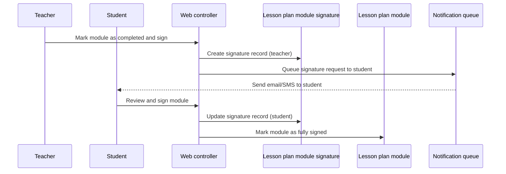
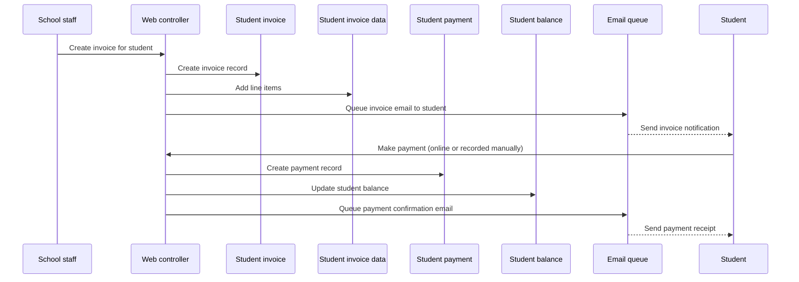
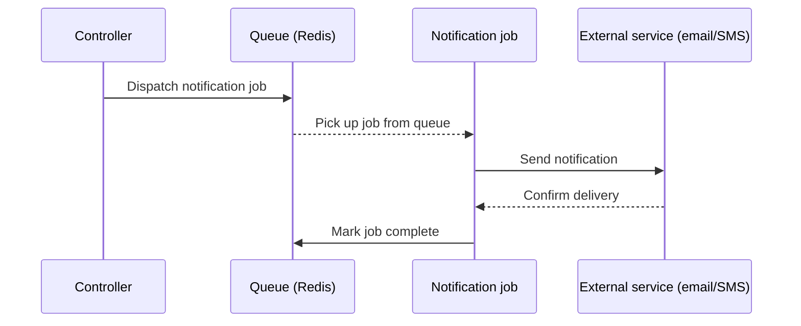

# Data Flow Diagrams

This page describes how data flows through the Just Driving system for common use cases. It complements the ER diagrams by showing the sequence and direction of data movement across entities when typical workflows are executed.

## Overview

Data flow diagrams focus on:

- Which entities are read from and written to during a workflow.
- The order in which data is created or updated.
- Where background jobs, notifications, or external integrations fit into the flow.

Understanding these flows helps developers see how changes in one part of the system affect related entities and helps with debugging, performance optimization, and feature development.

## Student registration and school enrollment

This flow describes what happens when a new student signs up and is enrolled in a school.

- A new student record is created with contact and login details.
- The student is linked to a school via the school–student join table.
- An initial invoice may be created (for example, signup fee or first course payment).
- A welcome email with login credentials is queued and sent asynchronously.

## Booking creation and student assignment

This flow describes how a teacher or school staff member creates a booking and assigns students to it.

- A booking is created with details such as date, time, teacher, booking type, and address.
- One or more students are assigned to the booking via the booking–student link.
- Notifications (email and/or SMS) are queued to inform students of the new booking.

## Lesson completion and signature

This flow describes what happens when a lesson or module is completed and signed off by both student and teacher.

- The teacher completes a lesson plan module and signs it.
- A signature record is created with the teacher's signature and timestamp.
- The system notifies the student to review and sign the module.
- Once the student signs, the signature record is updated and the module is marked complete.

## Invoice creation and payment

This flow describes how an invoice is created for a student, a payment is registered, and the student's balance is updated.

- An invoice is created with one or more line items describing services or fees.
- The student is notified via email.
- When payment is made (online via Stripe or recorded manually), a payment record is created.
- The student's balance is updated to reflect the payment.
- A payment confirmation is sent to the student.

## Notification and background jobs

Many flows in Just Driving trigger asynchronous work via queues. Common patterns include:

- **Email notifications**: Queued jobs send emails for confirmations, reminders, password resets, and invoices.
- **SMS notifications**: Queued jobs send SMS messages via Twilio for booking reminders, cancellations, and urgent alerts.
- **External API calls**: When integrating with platforms like e-teori.dk, findkoreskole.dk, or Stripe webhooks, jobs handle slow or unreliable network operations without blocking HTTP requests.

The flow for a notification is:

This pattern keeps the application responsive and allows failed jobs to be retried automatically.
