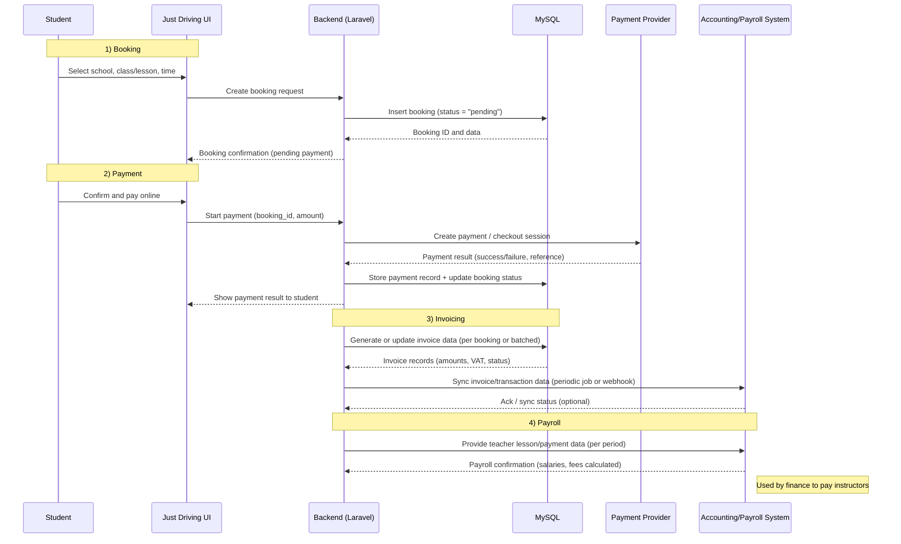

# Data flow diagrams 
**(Booking → Payment → Invoicing → Payroll)**

Below is a high-level data flow for the financial side of Just Driving, from booking creation through payment, invoicing, and payroll.

