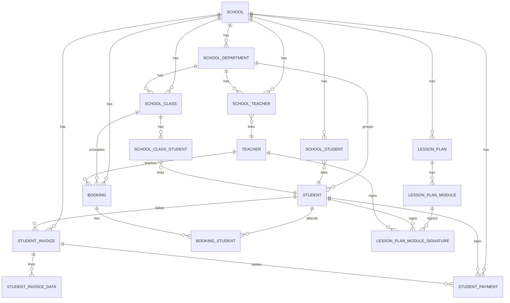

# Relationship Overview

This page describes how the core entities in the Just Driving data model relate to each other. It focuses on the main domains (schools, users, education, bookings, and finance) to give new developers a mental map before they dive into detailed ER diagrams or table definitions.

## High-level domain relationships

At a high level, the system can be thought of as five main domains:

- **Schools and organization** – schools, departments, and links between schools, teachers, and students.
- **Users and actors** – admins, teachers, students, and their relationships to schools and classes.
- **Education and lesson plans** – lesson plans, modules, pensum, signatures, and education content.
- **Classes and bookings** – school classes, individual bookings, and links between bookings and students.
- **Finance and payments** – invoices, invoice items, payments, and balances for students and teachers.

These domains are connected so that:

- A school owns departments, teachers, students, classes, bookings, lesson plans, and financial records.
- Students belong to one or more schools and classes and participate in bookings that follow specific lesson plans.
- Teachers belong to schools and deliver lessons/bookings to students, which then drive salary/payment records.
- Invoices and payments are tied back to students, schools, and often specific products such as classes or booking types.

## Core relationships (diagram)

The diagram below shows a simplified view of key relationships between the main entities. It is not a full ER diagram, but it highlights the most important links.

You can refine naming to match your exact table and model names, but the structure reflects the main relationships.

## Schools, teachers, and students

Key relationships between schools, teachers, and students:

- A **school** can have many **departments**.
- A **school** can have many **teachers** via the school–teacher link.
- A **school** can have many **students** via the school–student link.
- A **department** can group teachers and students under the school (for example, different branches or locations).
- **Students** and **teachers** are linked to schools through join tables so the same person could theoretically be associated with multiple schools if needed.

This structure supports multi-tenant behavior, where each school keeps its own staff, students, classes, and configuration isolated from others.

## Education, lesson plans, and pensum

Key relationships in the education domain:

- A **lesson plan** belongs to a school (or is derived from a default template) and is used by one or more classes.
- A **lesson plan** has many **modules** (theory and practical segments), and each module can be linked to multiple **pensum** entries that define legal or curriculum requirements.
- **Signatures** link students and teachers to specific lesson plan modules, recording when modules are taught, repeated, and acknowledged.
- **Default lesson plans** and **default lesson plan modules** act as reusable templates that can be attached to booking types or schools to standardize teaching structures.

This allows the system to track not just that a student attended a lesson, but which curriculum elements were completed and signed off.

## Classes, bookings, and attendance

Key relationships around scheduling:

- A **school class** belongs to a school and optionally to a department and lesson plan. It represents a group of students following a schedule.
- A **school class** has many students through the school–class–student link.
- **Bookings** represent concrete scheduled events (for example, a practical driving lesson or theory session) and belong to a school and a teacher.
- A booking has a **booking type**, which defines its pricing, salary rules, and other behavior.
- **Students** join bookings through a booking–student link table, which lets multiple students be assigned to the same booking (for example, group theory or car-sharing).

This design separates the concept of a class (a course cohort) from bookings (individual time slots and events).

## Invoices, payments, and balances

Key relationships in finance:

- A **student invoice** belongs to a school, a student, and often a teacher (or product reference).
- An invoice has many **invoice data/line items**, each describing a specific service or fee (including cancellation fees if applicable).
- **Student payments** belong to a school, a student, and reference a specific invoice (or subscription ID).
- Student balances can be derived from the combined history of invoices and payments, and are often cached in a dedicated **student balance** entity.

This allows the system to track what each student owes, what has been paid, and how that ties back to specific classes, bookings, or products.
